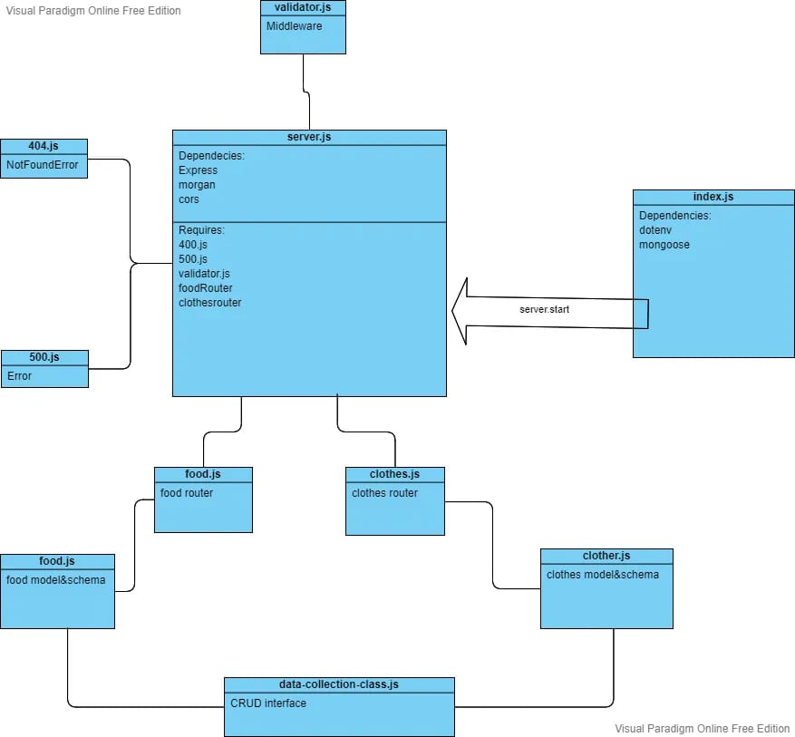

# api-server

Create 2 SQL data models using Sequelize, exported as Node Modules
Create a Collection Class that accepts a Sequelize Model into the constructor and assigns it as this.model
This class should have the following methods defined, to perform CRUD Operations
Each method should in turn call the appropriate Sequelize method for the model
- create()
- get() or read()
- update()
- delete()

**Links**
[heroku](https://apiserverwijdan.herokuapp.com/)

[PL](https://github.com/wijdankhaled/api-server/pull/2)

**UML**
